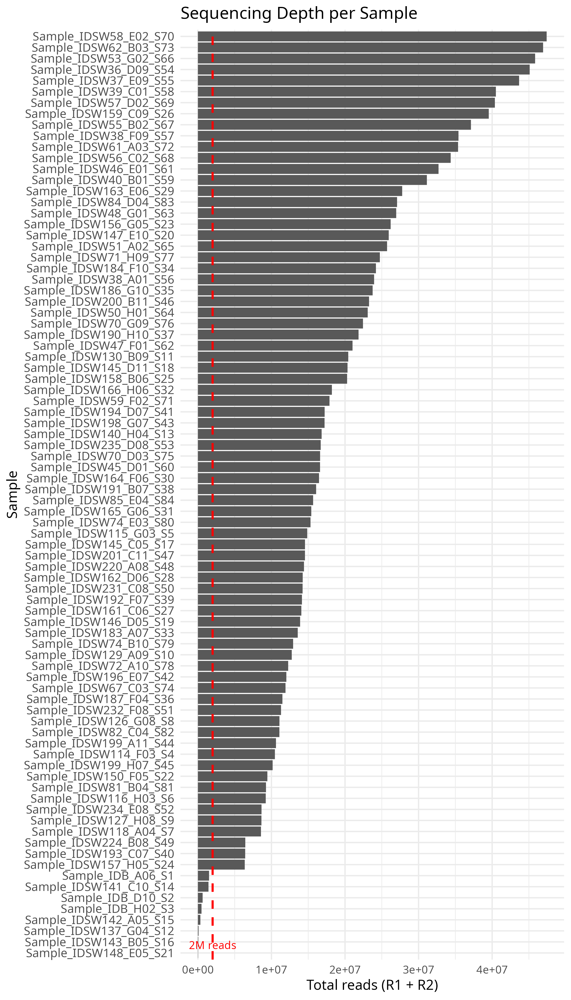

# GBS Pipeline: FASTQ to VCF for Population Analysis

Complete pipeline for processing Genotyping-by-Sequencing (GBS) data from raw FASTQ files to VCF format suitable for Structure and other population genetics analyses.

The GBS data was generated by the University of Minnesota Genomics Center (UMGC), which enables the generation of high-quality sequence data at a low cost by multiplexing large numbers of samples together on a sequencing lane. However, this approach requires some data manipulation before analysis. For this, we use [gbstrim.pl](https://bitbucket.org/jgarbe/gbstrim/src/master/).

This pipeline consists of two main steps:
1. **Quality Control (QC)**: Includes FastQC, MultiQC, and gbstrim
2. **SNP Calling**: Uses Stacks (denovo.pl and populations scripts)

## Software Used

- **FastQC**: v0.12.1
- **MultiQC**: v1.33
- **gbstrim**: [https://bitbucket.org/jgarbe/gbstrim/src/master/](https://bitbucket.org/jgarbe/gbstrim/src/master/)
- **Stacks**: v2.68

## Results

### Step 1: Quality Control

We first check the depth of the sequencing effort; samples with very low sequence counts are discarded.

**Table 1. Sequencing depth** (`raw/counts_table.csv`)



#### Paired-end Files Summary

- **Raw files**: 168
- **Samples**: 84
- **Files with more than 1M reads**: 152
- **Samples (>1M reads)**: 76
- **Discarded files** (less than 1M reads): 16
- **Discarded samples**: 8

We then check general QC statistics after trimming.

**MultiQC results**: [`run2/01_fastqc/raw_multiqc_report.html`](run2/01_fastqc/raw_multiqc_report.html) *(download locally to view)*

#### Trimming with gbstrim.pl

We use gbstrim.pl to remove restriction sites, discard reads shorter than 70bp, and trim reads longer than 70bp.

Parameters used:
```bash
--enzyme2 psti
--enzyme1 mspi
--croplength 70
--removecutsite
```

#### Resyncing Paired-end Files

We use resync.pl to synchronize R1 and R2 files. This ensures that for each sample, R1 and R2 files contain the same records. During the gbstrim.pl process, some records from R1 may be discarded while retained in R2 (and vice versa). The resync.pl script retains only the reads present in both R1 and R2 after trimming.

**Summary QC**: 


**Table**: [`plots/qc_summary.txt`](plots/qc_summary.txt)

We verify quality again with FastQC.

**MultiQC after trimming**: [`run2/01_fastqc/resynced/resynced_multiqc_report.html`](run2/01_fastqc/resynced/resynced_multiqc_report.html) *(download locally to view)*

### Step 2: Variant Calling Results

The Stacks pipeline (denovo.pl and populations scripts) primarily depends on the following parameters:

#### denovo.pl Parameters

- **-M 2**: Maximum distance between stacks (BETWEEN individuals)
- **-m 3**: Minimum depth of coverage
- **-n 1**: Maximum distance between stacks (WITHIN catalog)

#### populations Parameters

- **-r 0.65**: SNP present in 65% of samples
- **-p 1**: SNP present in ALL populations (we assume only 1 population at this point)
- **--min-mac 3**: At least 3 copies of minor allele
- **--min-maf 0.05**: 5% minimum allele frequency
- **--max-obs-het 0.7**: Maximum observed heterozygosity
- **--write-single-snp**: To avoid linkage disequilibrium (LD) between SNPs in the same locus

#### Variant Filtering (VCFtools)

Additional polishing with VCFtools:
- **Depth filters**: `--minDP 8 --maxDP 100`
- **Hardy-Weinberg**: `--hwe 0.01`
- **Mean depth for paralog detection**: `--max-meanDP 100`

## GBS Parameter Testing Summary

### Phase I: Structural Parameter Exploration

| Run  | M | m | n | r    | p | min-mac | min-maf | max-obs-het | write-single-snp | minDP | maxDP | HWE  | max-meanDP | Final SNPs | Strategy                      |
|------|---|---|---|------|---|---------|---------|-------------|------------------|-------|-------|------|------------|------------|-------------------------------|
| Run2 | 2 | 3 | 1 | 0.65 | 1 | 3       | 0.05    | 0.7         | TRUE             | 8     | 100   | 0.01 | 100        | 19         | Moderate clustering           |
| Run3 | 1 | 3 | 1 | 0.65 | 1 | 3       | 0.05    | 0.7         | TRUE             | 8     | 100   | 0.01 | 100        |            | More stringent clustering     |
| Run4 | 3 | 3 | 2 | 0.65 | 1 | 3       | 0.05    | 0.7         | TRUE             | 8     | 100   | 0.01 | 100        |            | Relaxed clustering            |
| Run5 | 2 | 2 | 1 | 0.65 | 1 | 3       | 0.05    | 0.7         | TRUE             | 8     | 100   | 0.01 | 100        |            | Lower coverage threshold      |
| Run6 | 3 | 2 | 2 | 0.65 | 1 | 3       | 0.05    | 0.7         | TRUE             | 8     | 100   | 0.01 | 100        |            | Most relaxed                  |

